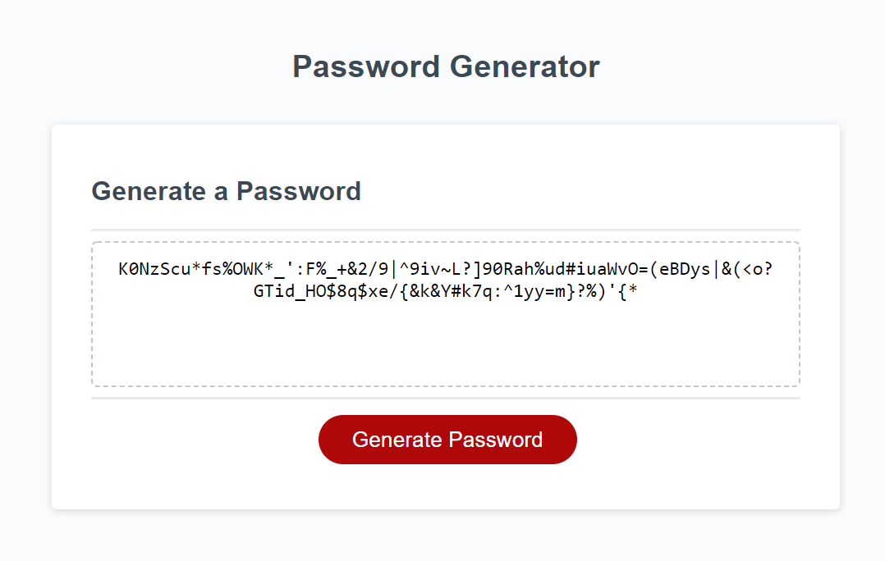

# password-generator
Week 3 Homework

This homework required us to write a function to generate a password using inputs from a user detailing the length and character types. 

The most difficult part about this is assignment was deciding which logic that we have been taught will best suit this logic. With time I am sure this will become more obvious.

### Screenshot

### URL
https://abelperio.github.io/password-generator/